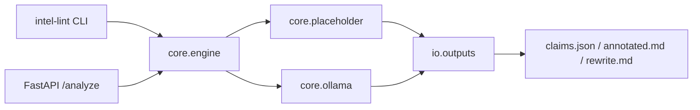

# Intel Lint Overview

## Purpose
Intel Lint evaluates CTI narrative text and outputs:
- `claims.json` with claim/evidence/bias structure
- `annotated.md` with span-linked annotations
- `rewrite.md` with neutralized wording

This project is educational/research software. It is not a security product.

## Architecture

## Operational behavior
- Default mode is `ENGINE=placeholder` for deterministic offline operation.
- `ENGINE=ollama` is optional and requires local Ollama runtime.
  `start-dev.cmd ollama <backend>` supports `ipex`, `nvidia`, and `vulkan`.
- API endpoint `/download/latest` bundles latest output artifacts.

## Limits and assumptions
- Claim extraction is text-bound only; no external fact validation is performed.
- Bias flags are heuristic and should be reviewed by an analyst.
- Evidence spans may miss nuanced context in highly formatted reports.
